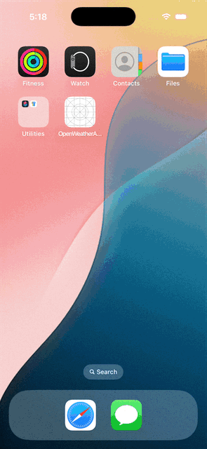

# OpenWeatherApp

Simple Weather app created with OpenWeather Api Service. .
App will fetch weather information by City and location. This application will be helpful for iOS Engineers.

OpenWeatherApp implemented with UIKit and SwiftUI. 

OpenWeatherApp project followed MVVM-C(Model View ViewModel and Coordinator) architecture pattern.

App implemented with iOS, swift framework and SwiftUI. Its pure iOS Native Application.

No third-pary dependencies used in the app. It's plain iOS project.

# Features!
  - Find the weather information by City.
  - Got the weather information by Location.

# Technical Specification!
  - XCode
  - iOS 16
  - Simulator or iOS device

iOS XCTest framework is used for UnitTesting.
Basic unit test coverage has done.

iOS XCTest framework is used for UITesting
POM(Page Object Model) pattern used For UI Testing, Still requre more usecases to write.

Good number of test coverage has done. 

### Example
Potrait                    
:-------------------------:
             

### Project Overview
 MVVM-C                                       | Unit Test & UITest                               
:-------------------------------------------:|:-------------------------------------------------:
           |  |

### App Images

Unit Test Result                   |  UI Test Result
:---------------------------------:|:-------------------------:
| 

License
-------

    Copyright 2024 Shahul Hameed Shaik

    Licensed under the Apache License, Version 2.0 (the "License");
    you may not use this file except in compliance with the License.
    You may obtain a copy of the License at

       http://www.apache.org/licenses/LICENSE-2.0

    Unless required by applicable law or agreed to in writing, software
    distributed under the License is distributed on an "AS IS" BASIS,
    WITHOUT WARRANTIES OR CONDITIONS OF ANY KIND, either express or implied.
    See the License for the specific language governing permissions and
    limitations under the License.
